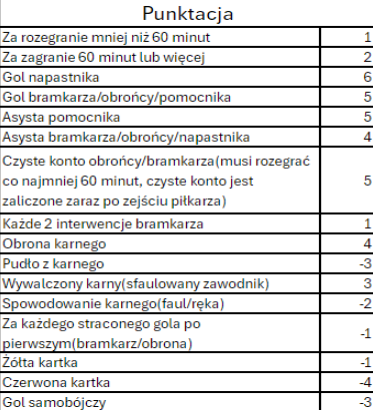

# PZ-pilkarskie-fantasy
Projekt piłkarskie fantasy realizowany w ramach programowania zespołowego UKW 2024

## Ważne linki

1. [Projekt poglądowy w Figma](https://www.figma.com/design/AwjHfh6r4Grny9PrBePrBO/Projekt-fantasy?node-id=0-1&t=slLytFACYrM4wtpF-1)
1. [Tablica Trello](https://trello.com/b/CS30swUS/programowanie-zespo%C5%82owe)
1.

## Zasady Fantsy

1. Budowa drużyny

Każdy menedżer ma do dyspozycji 100 milionów wirtualnych złotych na zakup 16 piłkarzy. Drużyna musi składać
się z dwóch bramkarzy, pięciu obrońców, pięciu pomocników i czterech napastników. Z jednego klubu można
wybrać maksymalnie trzech zawodników.

2. Wybór składu

Przed każdą kolejką menedżer wybiera 11 zawodników, którzy znajdą się w podstawowym składzie, oraz 5
rezerwowych. Rezerwa musi obejmować jednego bramkarza i czterech graczy z pola. W podstawowym składzie
zawodnicy mogą być ustawieni w dowolnej formacji spośród dostępnych wariantów.

3. Rezerwowi

Jeśli zawodnik z podstawowego składu nie zagra, zastępuje go rezerwowy według ustalonej kolejności. Rezerwowy
bramkarz wchodzi automatycznie, jeśli podstawowy bramkarz nie wystąpił. Punkty zawodników rezerwowych
(poza bramkarzem i pierwszym rezerwowym) są liczone jako połowa ich zdobytych punktów.

4. Transfery

W każdej kolejce można dokonać dwóch transferów. Jeśli transfer nie zostanie wykorzystany, przechodzi na
następną kolejkę, ale łączna liczba dostępnych transferów nie może przekroczyć czterech. Każdy dodatkowy
transfer poza dostępny limit skutkuje karą w postaci odjęcia czterech punktów od wyniku drużyny.

5. Bonusy

Każdy bonus można wykorzystać raz w sezonie. W jednej kolejce można użyć tylko jednego bonusu.
Potrójny kapitan: punkty kapitana są mnożone przez trzy.
Bench boost: punkty zdobyte przez wszystkich rezerwowych są wliczane do wyniku drużyny.
Limitless: w jednej kolejce można wybrać dowolnych zawodników bez ograniczeń budżetowych.
Dzika karta: umożliwia dokonanie nieograniczonej liczby transferów.

6. Zmiany cen

Po kolejce zawodnikom może zmienić się cena: wzrost o 0.2 jeśli zdobędzie 10+ punktów, wzrost o 0.1 za 6-10
punktów, spdek o 0.2 za trzy 'blanki' z rzędu(0-2 pkt)

